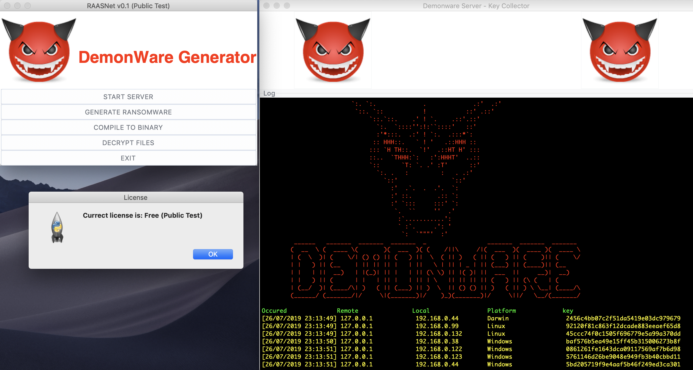

<h1 align="center">
   RAASNet
</h1>

<p align="center">
  Ransomware As A Service (By @TheRealZeznzo)
</p>




<h1 align="center">
  Super Fast Encryption!
</h1>
<br>


<br>
Still in development. More features and customisations coming soon.
<br>

<h1 align="center">
   Usage Demo
</h1>

<a href="https://www.youtube.com/embed/kVtM_xL7_YA" target="_blank"></a>

<h1 align="center">
   Please read
</h1>
<br>
<p align=center>
   This was made to demonstrate ransomware and how easy it is to make. It works on Windows, Linux and MacOS. It's recommended to compile payload.py to EXE to make it more portable.
</p>
<br>
<p align=center>
   I do work on security awareness trainings and test the IT security and safety for other companies and you guessed it; this was made for the demo section of my presentation, NOT TO EARN MONEY OR BRICK PEOPLES COMPUTERS.
</p>
<br>
   This script does not get detected by any anti-virusses. Self made scripts go undetected 99% of the time. It's easy to write something nasty like ransomware, adware, malware, you name it. Again, this script was for research only. Not ment to be used in the open world. I am not responsible for any damage you may cause with this knowledge. 
   
   I recommend a VPN that allows port forwarding (For example; PIA VPN) when using this outside your network, or better, a cloud computer hosted elsewhere, like Amazon AWS. 
   
   The conclusion of this project is that it is easy to brick a system and earn money doing it. This script doesn't use any exploits to achieve its goal, but can easily be coded into it as a nice feature.
<br>

<h1 align="center">
   Features
</h1>
<br>

+ Generate a ransomware payload
+ FUD (Fully UnDetectable by Anti-Virus)
+ Works on Windows, MacOS and Linux
+ Super fast encryption with PyCrypto
+ Compile to to EXE, APP or Unix/Linux executable
+ Set a custom icon for your EXE payload
+ Receive keys of victums
+ Decrypt files
+ Demo mode (payload won't encrypt anything)
+ Fullscreen mode (Warning takes over the screen)
+ Custom warning message for your victim

<h1 align="center">
   Upcoming features
</h1>
<br>

+ ~~Custom warning message for your victim~~
+ Custom file extentions to encrypt
+ Custom file extention for encrypted
+ Encrypt everything with a file extention
+ Set target locations
+ Generate a payload without GUI
+ Set custom password to lock files with (instead of a random generated key)
+ Ghost mode (Rename by adding .DEMON extention instead of encrypting the files)
+ Export keys to CSV or HTML

<h1 align="center">
   Installation
</h1>

Download and install the latest version of Python 3.<br>
<br>
Then do:<br>
```Shell
git clone https://github.com/leonv024/RAASNet.git
```

```Shell
pip3 install -r requirements.txt
```

```Shell
python3 RAASNet.py
```
